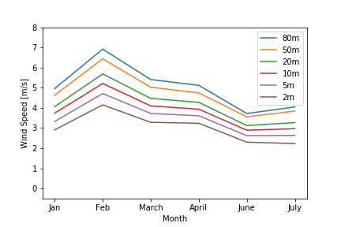
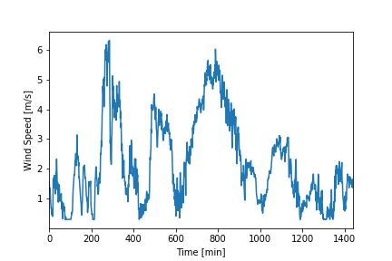
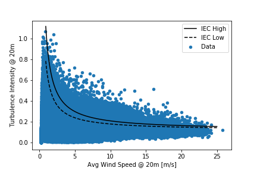
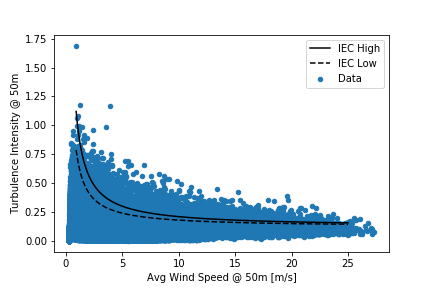
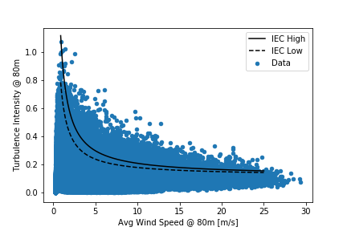
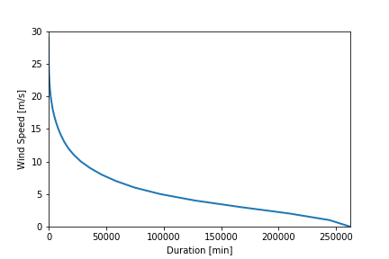

# Wind_Energy
# Statistical Data Analysis
## Introduction
Based on the data set (Met_Data_2016) which contains six months of wind measurement data collected in 1 min intervals, the following statistical data analysis was conducted. 

## Wind Data Characteristics
Average wind speed and standard deviation for all the data.

Average wind speed for each month in the six month range.

Wind speed over a single day.

Turbulence intensity at 20, 50 and 80 m and compared to IEC high/low values.

Velocity Duraction Curves for the varying height measurements.

Histogram of the velocity data with the Weibull and Rayleigh velocity distribution curves normalized and superimporse.

